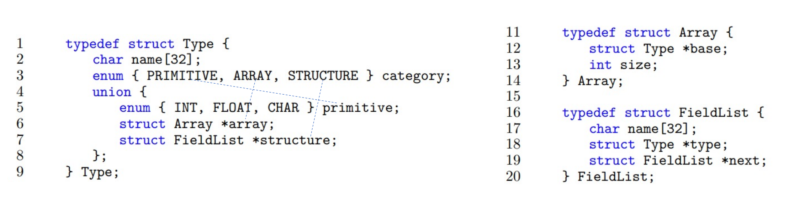
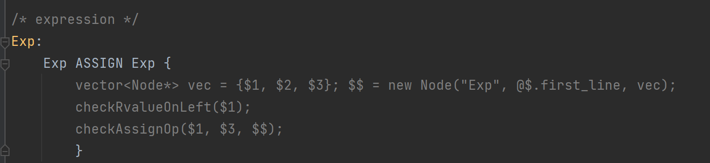
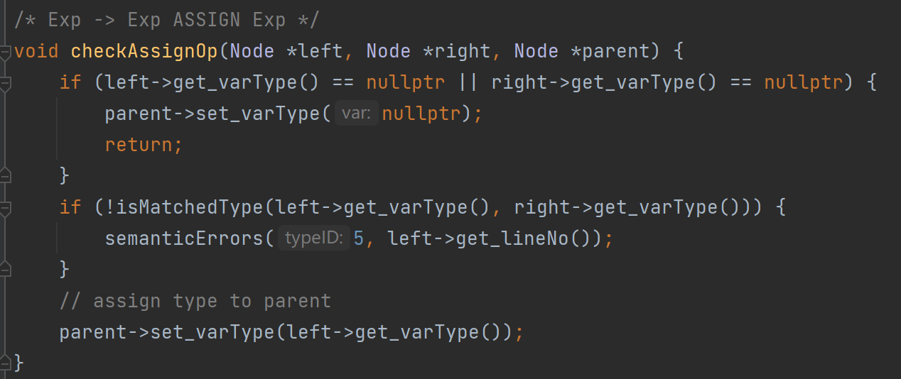
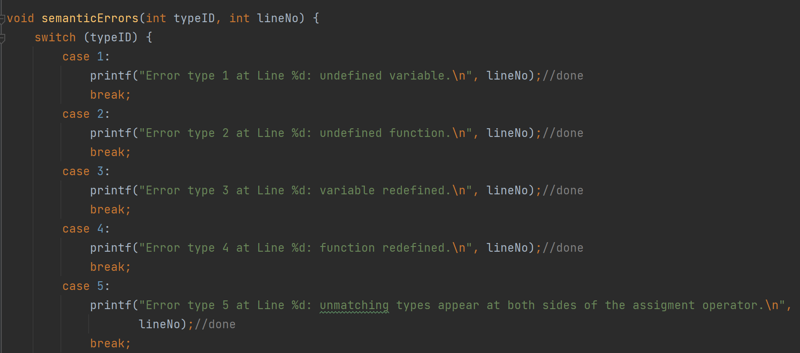
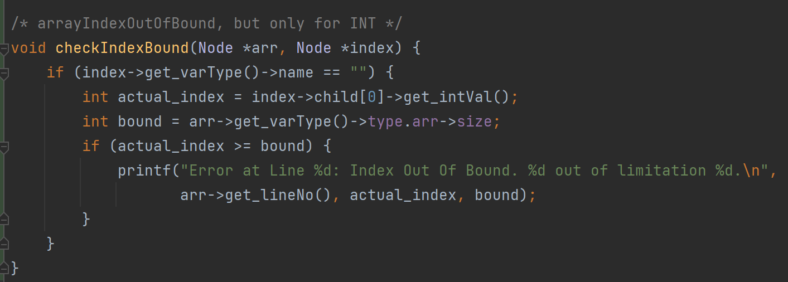

# CS323 Project2

###  Semantic Analysis

##### **Team Members: Li Yuanzhao(11812420), Xu Xinyu(11811536), Jiang Yuchen(11812419)**


## I. Overview

​		In this project, we are required to implement semantic analysis based on Project 1 which implements lexical and syntax analysis. We will detect `15-type` semantic errors and some extra semantic errors with `bin/splc`  for given SPL(Sustech Programming Language) code. Our files can be run successfully with GCC version 7.4.0, GNU Flex version 2.6.4 and GNU Bison version 3.0.4 .


## II. Design and Implementation

​		Based on finished `lex.l` , `syntax.y` and other useful files, we start our semantic detection by constructing `spl_type.hpp` to define each type in detail.

### A. SPL_Type

​		We refer to the definition in Lab slides. We define three classes named `Type`, `Array` and `FieldList` to store the information which we will need when detecting possible semantic errors.



​																			Figure.1 Reference Slide

```C++
enum class CATEGORY { PRIMITIVE, ARRAY, STRUCTURE,STRUCTVAR, FUNCTION };
enum class Primitive { INT,FLOAT,CHAR };

class Type;
class Array;
class FieldList;
union dTypes {
    Primitive pri;
    Array *arr;
    FieldList *fl;
    Type *st;
};
class Type {
public:
    string name;
    CATEGORY category;
    dTypes type;
    Type *typePointer = nullptr; // For func: return type; For struct number: nearest outlayer struct
};
class Array {
public:
    Type *base;
    int size;
};
class FieldList {
public:
    string name;
    Type *type;
    FieldList *next;
};

```


### B. Symbol_Table

​		After that, we continue to build up the symbol table which is one of the most important data structure in this project. We use `map<string, Type *>` to store symbols together with its Type for error detection.

​		According to given 15-type semantic errors, we first locate their position in `syntax.y` so that we can add our self-defined action or function to check possible semantic errors. For example, we add function `checkRvalueOnLeft($1)` and `checkAssignOp($1, $3, $$)`  to check ***type 6*** and ***type 5*** error respectively. What's more, if there is no error to report, the last function will `set_varType()` to root node which will transfer the Type information to upper level.



​																				Figure.2 Add self-defined function

​		When detecting errors, we will call `semanticErrors(int typeID, int lineNo)` to report the semantic errors. 



​																				Figure.3 Call `semanticErrors()` in function



​																				Figure.4  `semanticErrors()`  function


 

### 	C. Other Key Points


### D. Bonus

​		// TODO

​		accessing inside number of struct

​		struct declare name misuse

​		(exp)

​		When using INT(not ID) to access array, we can detect whether it's out of bound.



​																			Figure.5 check for index out of bound error


## III. Test Cases

​			For evaluation purpose, our test cases contain **x** different semantic errors. All of test cases are saved in `./test/` folder.

​			For extra test cases, we put them in `./test-ex/` folder which contains four test cases. They are used for checking index out of bound error, xxxxxx .

​			**- Test case with Type-X error**

```spl

```

​			**- Ex-Test case with Index Out Of Bound error**

```spl
int main(){
  int a[3][4][5];
  int b = a[2][3][10];
}
-------------------------------------------------------------------
Error at Line 3: Index Out Of Bound. 10 out of limitation 5.
```


## IV. Instructions

​			Change directory to the root path and using `make splc` to create `splc` in `./bin` root for spl codes' parsing. Then using `bin/splc test/<file_name>` to create semantic analysis result. And you can use `make clean` to delete all created files.

