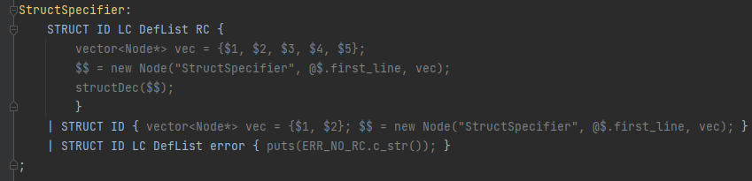
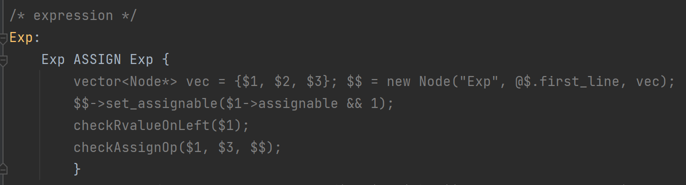
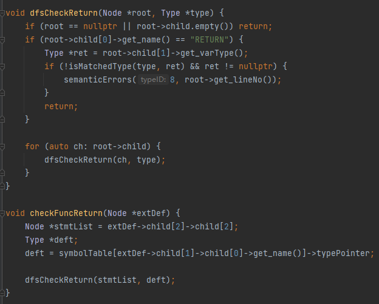
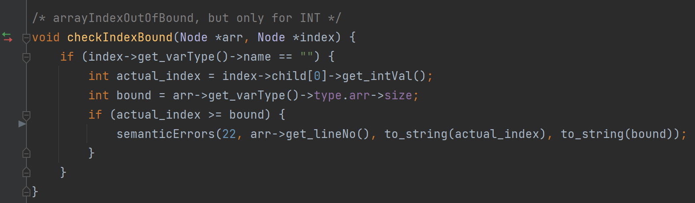
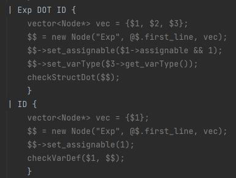

# CS323 Project2

###  Semantic Analysis

##### **Team Members: Li Yuanzhao(11812420), Xu Xinyu(11811536), Jiang Yuchen(11812419)**

## I. Overview

​		In this project, we are required to implement semantic analysis based on Project 1 which implements lexical and syntax analysis. We will detect `15-type` semantic errors and some extra semantic errors with `bin/splc`  for given SPL(Sustech Programming Language) code. Our files can be run successfully with GCC version 7.4.0, GNU Flex version 2.6.4 and GNU Bison version 3.0.4 .


## II. Design and Implementation

### A. SPL_Type

​		We refer to the definition in Lab slides. We define three classes named `Type`, `Array` and `FieldList` to store the information which we will need when detecting possible semantic errors.

```C++
enum class CATEGORY { PRIMITIVE, ARRAY, STRUCTURE,STRUCTVAR, FUNCTION };
enum class Primitive { INT,FLOAT,CHAR };

class Type;
class Array;
class FieldList;
union dTypes {
    Primitive pri;	Array *arr;	FieldList *fl;	Type *st;
};
class Type {
public:
    string name;	CATEGORY category;	dTypes type;	Type *typePointer = nullptr; 
};
class Array {
public:
    Type *base;	int size;
};
class FieldList {
public:
    string name;	Type *type;	 FieldList *next;
};
```

### B. Symbol_Table

​		After that, we continue to build up the symbol table which is one of the most important data structure in this project. We use `map<string, Type *> symbolTable` to store symbols together with its Type for error detection.

​		According to given 15-type semantic errors, we first locate their position in `syntax.y` so that we can add our self-defined action or function to check possible semantic errors. For example, we add function `checkRvalueOnLeft($1)` and `checkAssignOp($1, $3, $$)`  to check ***type 6*** and ***type 5*** error respectively. What's more, if there is no error to report, the last function will `set_varType()` to root node which will transfer the Type information to the upper level.

​														



​													Figure.1 Add self-defined function

​		When detecting errors, we will call `semanticErrors(int typeID, int lineNo, string arg1, string arg2)` to report the semantic errors. `arg1` and `arg2` are used to store the information about relative variables, function and other value.





​													Figure.2 Call `semanticErrors()` in function

### 	C. Other Key Points

  1. We modified `spl_node.hpp` and add a field named `assignable` which is set to `false` initially to record whether a node can be assigned or not. It's mainly used in `Exp` syntax and only `Exp -> Exp LB Exp RB | ID `  can be directly assigned. Considering continuous assign, expression with parentheses and structure with DOT, `Exp -> Exp ASSIGN Exp | LP Exp RP | Exp DOT ID` can be assign with the judgement of the first `Exp`'s assignable.

     

     ​													Figure.3  set_assignable()																				

  2. In SPL_Type, we define `STRUCTURE`, `STRUCTVAR` and `FUNCTION` to represent the category for structure type, structure's field type and function type. 

     Also, the field `Type *typePointer = nullptr;` in Type is used for function and structure which store their return type and nearest out-layer struct when needed.

  3. **When facing error, especially in `Exp` syntax, we will try to ignore it as detecting other type of error. For example, if there are INT and FLOAT variables to be added and assigned to a INT variable, then the right side's varType will be nullptr. When checking ASSIGN, it will ignore the error and directly return as receiving nullptr. What' more, if left side is not assignable, we will also return directly and ignore type check between two side of ASSIGN.** e.g. (Official test cases) In `test_2_r07.spl`  line 10, since we detect ***type 7*** error in right side, we set the varType as nullptr for right side and ignore type check at ASSIGN. Similarly for `test_2_r12.spl` line 15, `test_2_r14.spl`  line 10 & 12,  the left side of ASSIGN has nullptr for varType. 

### D. Bonus

1. When using INT(not ID) to access array, we can detect whether it's out of bound. ***Type 22*** is defined for it. (shown in Figure.2)

2. Considering continuous assign, expression with parentheses for type 6 error, using `assignable` field in Node to recursively record the node information about assignable. (shown https://github.com/CharlotteE67/CS323-proj2.git Figure.4)
3. When accessing inside number of struct, the complier should detect it as error according to CATEGORY::STURCTVAR. ***Type 20*** is defined for reporting the error. Also, structure declare name misuse will be detect as ***Type 21*** error.


## III. Test Cases

​			For evaluation purpose, our test cases contain **14** different semantic errors. All of test cases are saved in `./test/` folder.

​			For extra test cases, we put them in `./test-ex/` folder which contains four test cases. They are used for checking ***type 20, 21, 22*** error.

​			**- Test case with Type 21 error**

```SPL
struct a {
    int aa;
};
struct b{
    struct a ba;
};
struct c{
    struct a ca;
};
int main(){
    struct b B;
    struct c C;
    b.ba = C.ca;

}
-----------------------------------------------
Error type 21 at Line 13: struct declare name misuse.
```


## IV. Instructions

​			Change directory to the root path and using `make splc` to create `splc` in `./bin` root for spl codes' parsing. Then using `bin/splc test/<file_name>` to create semantic analysis result. And you can use `make clean` to delete all created files.
